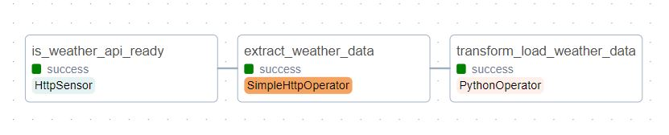

# ETL-pipeline-with-airflow-on-AWS-EC2

Learn how to build and automate an ETL process that can extract current weather data from open weather map API, transform the data and load the data into an S3 bucket using Apache Airflow.

sudo apt update
sudo apt install python3-pip
sudo apt install python3.10-venv
python3 -m venv airflow_venv

source airflow_venv/bin/activate

sudo pip install pandas
sudo pip install s3fs
sudo pip install apache-airflow
airflow standalone

username: admin  password: XXXXXXXX

Weather Map API: https://openweathermap.org/api
weather API key : XXXXXXXX

create credential access key  
access key ID : XXXXXXXX
Secret access key : XXXXXXXX

sudo apt  install awscli
aws configure
aws sts get-session-token

Overview 
